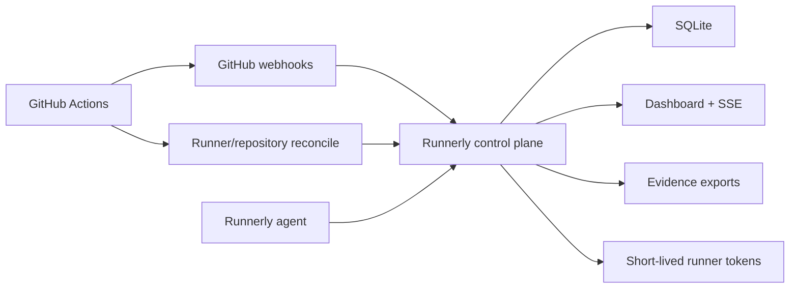

# Actions Runner Control Plane

Actions Runner Control Plane is a portfolio edition of a self-hosted GitHub
Actions runner operations product. It turns runner fleet operations into a
product surface: live runner status, repository policy, workflow evidence,
onboarding commands, audit history, and GitHub webhook telemetry in one small
dashboard.

This repository is intentionally sanitized. It uses demo organizations,
demo runners, local SQLite data, and placeholder deployment examples so it can
be reviewed publicly without exposing any real production infrastructure.

## Why This Exists

Self-hosted runners are powerful, but most teams operate them through scattered
scripts, runner labels, GitHub settings pages, and tribal knowledge. This
project explores what a thin control plane can add on top of GitHub Actions
without replacing GitHub Actions itself:

- Which runners are online, idle, busy, stale, or offline?
- Which repositories are allowed to use self-hosted runners?
- Which workflows still use broad `self-hosted` labels instead of specific
  runner classes?
- Which public repositories are telemetry-only and should remain GitHub-hosted?
- What evidence can an operator export during an incident or audit review?

## Highlights

- Node.js control plane with SQLite persistence.
- Static dashboard served by the control plane.
- Server-sent events for live dashboard refreshes.
- GitHub webhook ingestion for `workflow_job`, `workflow_run`, and `repository`
  events.
- Optional GitHub App mode for runner reconciliation and short-lived
  registration tokens.
- GitHub OAuth admin login with a local token fallback for development.
- Runner heartbeat agent for managed hosts.
- Repository onboarding readiness and workflow label guidance.
- Policy report for public-repo guardrails and broad runner labels.
- Evidence exports for runners, repositories, jobs, and audit events.
- Local SQLite backup and restore-drill workflow.
- Demo data enabled by default for a recruiter-friendly local walkthrough.

## Quick Start

Actions Runner Control Plane requires Node.js 24 or newer because it uses Node's built-in SQLite
module.

```bash
npm install
npm run dev
```

Open:

```text
http://127.0.0.1:8787
```

The local dashboard starts with seeded demo data unless
`RUNNERLY_SEED_DEMO_DATA=false` is set.

Emit one managed-runner heartbeat:

```bash
npm run agent:once
```

Run checks:

```bash
npm run check
npm test
```

Verify backup restore behavior:

```bash
npm run restore:drill
```

## Local Auth

Token auth is useful for local development:

```bash
RUNNERLY_ADMIN_TOKEN=local-admin \
RUNNERLY_AGENT_TOKEN=local-agent \
npm run dev
```

Then sign in with `local-admin`.

GitHub OAuth can also be tested locally with a GitHub OAuth app:

```bash
RUNNERLY_PUBLIC_BASE_URL=http://127.0.0.1:8787 \
RUNNERLY_GITHUB_OAUTH_CLIENT_ID=... \
RUNNERLY_GITHUB_OAUTH_CLIENT_SECRET=... \
RUNNERLY_GITHUB_ADMIN_ORG=example-org \
RUNNERLY_GITHUB_ADMIN_TEAM_SLUGS=platform-admins \
RUNNERLY_GITHUB_ALLOW_ORG_ADMINS=true \
RUNNERLY_SESSION_SECRET=local-session-secret \
npm run dev
```

Use this callback URL in GitHub:

```text
http://127.0.0.1:8787/api/auth/github/callback
```

## GitHub Integration

Actions Runner Control Plane can run in two modes:

- **Webhook mode:** ingest GitHub workflow telemetry with a webhook secret.
- **Management mode:** use a GitHub App installation to reconcile runner state
  and mint short-lived runner registration tokens.

Example environment:

```text
RUNNERLY_GITHUB_WEBHOOK_SECRET=replace-with-secret
RUNNERLY_PUBLIC_WEBHOOK_URL=https://runnerly.example.test/api/github/webhook
RUNNERLY_GITHUB_APP_ID=
RUNNERLY_GITHUB_INSTALLATION_ID=
RUNNERLY_GITHUB_APP_PRIVATE_KEY_FILE=/etc/runnerly/github-app.private-key.pem
RUNNERLY_GITHUB_RUNNER_SCOPE=org
RUNNERLY_ALLOWED_REPOSITORIES=example-org/actions-runner-control-plane:linux+arm64+build-worker,example-org/security-scanner:linux+arm64+scanner,example-org/utility-scripts:linux+x64+micro+utility
RUNNERLY_RECONCILE_ENABLED=true
RUNNERLY_RECONCILE_INTERVAL_MS=300000
RUNNERLY_RUNNER_HEARTBEAT_INTERVAL_MS=30000
RUNNERLY_TOKEN_LOGIN_ENABLED=false
```

Webhook target:

```text
POST https://runnerly.example.test/api/github/webhook
```

Supported events:

- `ping`
- `repository`
- `workflow_job`
- `workflow_run`

## Architecture



See [docs/architecture.md](docs/architecture.md) for the deeper component
breakdown and [docs/security-model.md](docs/security-model.md) for the security
boundary.

## Repository Layout

```text
apps/
  agent/          Runner heartbeat and host probe process.
  control-plane/  API, SQLite persistence, auth, GitHub integration.
  dashboard/      Static dashboard assets.
docs/             Architecture, security model, and operator notes.
examples/         Local configuration examples.
ops/              Generic systemd and Linux host examples.
packages/shared/  Shared validation and domain helpers.
scripts/          Repository checks and restore drill.
tests/            Node test runner coverage.
```

## What This Demonstrates

- Platform engineering product thinking.
- GitHub Actions and self-hosted runner operations.
- Webhook processing and signature verification.
- GitHub App authentication flows.
- Live browser updates with SSE.
- SQLite-backed operational state.
- Policy reporting and audit evidence.
- Practical security boundaries for internal tools.

## Sanitization Notes

This public version deliberately avoids real organization names, runner names,
domains, IP addresses, SSH paths, secrets, GitHub App IDs, and production audit
data. All sample values are placeholders or demo fixtures.
