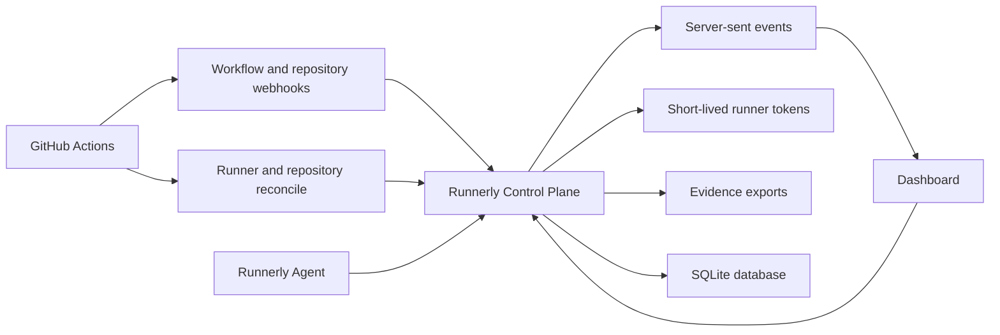

# Runnerly Lab Architecture

Runnerly Lab is a small control plane for self-hosted GitHub Actions runners.
GitHub Actions remains the CI engine; Runnerly owns runner visibility, policy
reporting, onboarding guidance, live operations, and evidence exports.

## Control Plane

The control plane is a Node.js service that:

- Serves the static dashboard.
- Exposes `/api/*` endpoints for fleet state.
- Persists runners, repositories, jobs, settings, and audit events to SQLite.
- Verifies GitHub webhook signatures when a webhook secret is configured.
- Treats GitHub webhooks as the live source for workflow job/run changes.
- Optionally uses GitHub App credentials to mint short-lived runner
  registration tokens.
- Polls the organization runner endpoint every 30 seconds by default for light
  online/busy/stale state.
- Runs full GitHub reconcile every five minutes by default when management mode
  is configured.
- Pushes browser refresh signals through server-sent events.
- Produces authenticated evidence exports and local SQLite backups.

The portfolio edition runs as a single process by design. That keeps the local
demo understandable while leaving room for future separation into API, worker,
and dashboard deployments.

## Dashboard

The dashboard is static HTML, CSS, and JavaScript served by the control plane.
After login, the browser opens `/api/events` and refreshes local state whenever
Runnerly receives a webhook, runner heartbeat, reconcile result, or audit event.
The browser never polls GitHub directly.

Dashboard sections include:

- Live operations.
- Runner fleet.
- GitHub integration status.
- Policy guardrails.
- Repository onboarding.
- Workflow inventory and migration findings.
- Jobs.
- Evidence exports.
- Audit events.

## Agent

The agent runs on managed runner hosts. It reports:

- Runner identity and labels.
- Hostname.
- Disk usage.
- Command checks.
- systemd service checks.
- Official GitHub Actions runner service status.

Runnerly can also observe external runners through GitHub reconciliation and
`workflow_job` telemetry, even before a Runnerly agent is installed on those
hosts.

## GitHub Integration

Runnerly supports two integration levels:

- **Webhook mode:** receive signed GitHub webhook events and update local job,
  repository, and audit state.
- **Management mode:** use a GitHub App installation to list organization
  runners, inspect repository visibility, read runner group policy, and create
  short-lived registration tokens.

## Runner Policy Model

Runnerly separates telemetry from self-hosted eligibility:

- Private repositories can be mapped to specific runner classes.
- Public repositories can send webhooks for visibility but should remain
  GitHub-hosted unless a team has explicitly designed a safe public-fork model.
- Workflows that use broad `self-hosted` labels are flagged because they do not
  declare a clear runner lane.

Example lanes:

| Lane | Intended Work |
| --- | --- |
| `build-worker` | Normal private build/test jobs |
| `scanner` | Security and dependency-heavy jobs |
| `micro utility` | Tiny scheduled or utility jobs |

## Storage

SQLite is the default because it makes the project easy to run locally and
inspect. The data model is intentionally narrow:

- runners
- repositories
- jobs
- audit events
- settings

The schema can later move to Postgres if multi-node control-plane deployment is
needed.

## Security Boundary

Runnerly does not claim compliance certification. It is a compliance-friendly
operations surface: signed webhooks, least-privilege repository allowlists,
specific runner labels, short-lived registration tokens, audit trails, and
repeatable host setup.

In a production-style deployment, bind the control plane to `127.0.0.1`, put it
behind a TLS reverse proxy, and use GitHub OAuth or another identity provider
for dashboard access.
